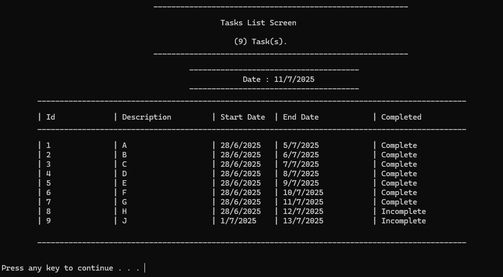
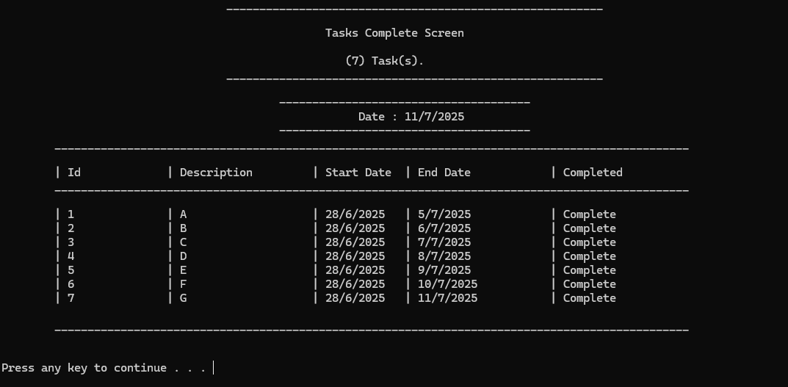
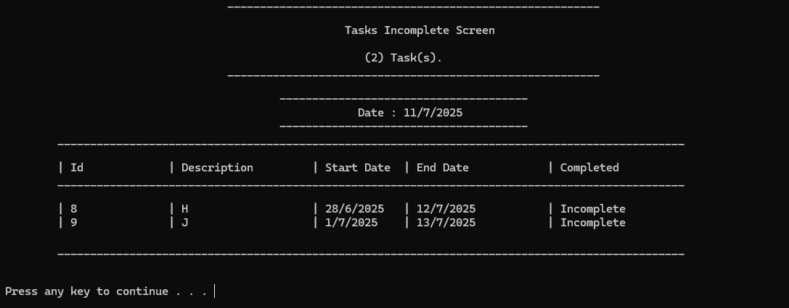

# Task-Manager
**نظام إدارة المهام باستخدام العقد المترابطة المنفردة (Singly Linked List)**

---

## 💡 فكرة المشروع  
محاكاة نظام بسيط لإدارة المهام (To-Do List) يتم فيه تمثيل البيانات في الذاكرة باستخدام هيكل بيانات من تصميمي:  
**العقد المترابطة المنفردة**، مع دعم التخزين في ملف وتحميل البيانات عند تشغيل النظام.

---

## 🛠 الأدوات والتقنيات المستخدمة  
- **لغة البرمجة:** C++  
- **هيكل البيانات المستخدم:** العقد المترابطة المنفردة (Singly Linked List)  
- **بيئة التطوير:** Visual Studio  
- **نمط التنفيذ:** واجهة نصية (CLI)  
- **التنظيم:** فصل الكود إلى ملفات رأسية وتنفيذية لهيكل البيانات ووظائف النظام

---

## 🧑‍💻 دوري كمطور  
- تحليل منطق النظام وتحديد المتطلبات الأساسية (إضافة – عرض – حذف – تعديل - حفظ – تحميل)   
- بناء نظام لتخزين المهام في ملف نصي وتحميلها إلى الذاكرة عند التشغيل  
- تصميم واجهة CLI تفاعلية للمستخدم للتعامل مع المهام  
- تنظيم الكود باستخدام ملفات `.h` و`.cpp` بشكل يسهل التوسعة لاحقًا

---

## 📦 الوظائف الأساسية للنظام  
- إضافة مهمة جديدة  
- عرض جميع المهام  
- حذف مهمة بناءً على رقمها أو وصفها  
- تعديل مهمة  
- حفظ المهام في ملف  
- تحميل المهام من الملف عند بدء التشغيل  
- التعامل مع البيانات فقط من خلال هيكل العقد، **بدون أي اعتماد على هياكل جاهزة**

---

## 🎯 الهدف من المشروع  
- تطبيق عملي لهياكل البيانات وربطها بتخزين الملفات  
- تعزيز الفهم العميق للعقد المترابطة وكيفية إدارتها في البرامج الواقعية  
- التدريب على كتابة كود نظيف ومنظم وقابل للصيانة  
- تأسيس بنية قوية لبناء أنظمة أكبر لاحقًا

---

## صور من المشروع 
### Main Menu

### Show All Tasks

### Show Completed Tasks

### Show Incompleted Tasks

---
## 📬 المطور

**محمد أحمد أحمد الهزمي**  
**ايميل : alhazmimohammed663@gmail.com**
